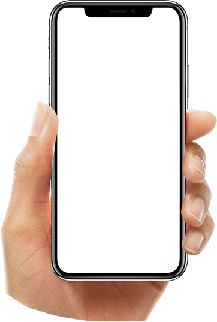

# Quba Mobile Website



## 📱 Overview

Quba Mobile is a modern, responsive landing page for a premium smartphone brand. The website showcases the key features and specifications of the Quba smartphone, including its battery life, camera capabilities, processor performance, display quality, and security features.

## ✨ Features

- **Modern Responsive Design**: Fully responsive layout that works seamlessly on desktop, tablet, and mobile devices
- **Interactive UI Elements**: Animated sections, hover effects, and interactive components enhance user experience
- **Performance Optimized**: Resource preloading, optimized images, and efficient code structure for fast loading times
- **SEO Ready**: Meta tags, semantic HTML, and accessible markup for better search engine visibility
- **Cross-Browser Compatible**: Tested and optimized for all modern browsers

## 🚀 Technical Details

### Technologies Used

- **HTML5**: Semantic markup structure
- **CSS3**: Modern styling with custom properties (CSS variables)
- **JavaScript**: Interactive features and animations
- **AOS Library**: Scroll-based animations
- **Font Awesome**: Icon library
- **Google Fonts**: Poppins and Inter font families

### Project Structure

```
quba-mobile/
├── index.html                  # Main HTML file
├── assets/                     # All assets
│   ├── css/                    # CSS files
│   │   └── style.css           # Main stylesheet
│   ├── images/                 # Image files
│   │   ├── android-image.png   # Android platform image
│   │   ├── banner-image.png    # Hero banner image
│   │   ├── battery-image.png   # Battery feature image
│   │   ├── camera-image.png    # Camera feature image
│   │   ├── display-image.png   # Display feature image
│   │   ├── face-lock-image.png # Security feature image
│   │   ├── processor-image.png # Processor feature image
│   │   └── shots1-8.png        # Gallery showcase images
│   └── js/                     # JavaScript files
│       └── script.js           # Main JavaScript file
└── README.md                   # Project documentation
```

## 🔧 Setup and Usage

### Local Development

1. Clone the repository:

   ```bash
   git clone https://github.com/yourusername/quba-mobile.git
   cd quba-mobile
   ```

2. Open the project in your code editor of choice.

3. Launch the site using a local development server:

   - Using Visual Studio Code's Live Server extension
   - Using Python's built-in HTTP server:
     ```bash
     python -m http.server
     ```
   - Using Node.js' http-server (after installing with npm):
     ```bash
     npx http-server
     ```

4. Access the site at `http://localhost:8000` or whatever port your server uses.

### Deployment

The website is static HTML/CSS/JS and can be deployed to any web hosting service:

- GitHub Pages
- Netlify
- Vercel
- Any standard web hosting provider

## 🎨 Customization

### Changing Colors

The color scheme can be easily modified by editing the CSS variables in the `:root` selector in `assets/css/style.css`:

```css
:root {
  /* Color Palette */
  --primary: #61c798;
  --primary-dark: #339a99;
  --secondary: #252734;
  /* Additional colors... */
}
```

### Adding New Features

To add new sections or features to the website:

1. Create a new section in `index.html` following the existing structure
2. Add corresponding styles in `style.css`
3. If needed, add JavaScript functionality in `script.js`

## 📝 Browser Compatibility

- Chrome (latest)
- Firefox (latest)
- Safari (latest)
- Edge (latest)
- Opera (latest)
- Mobile browsers (iOS Safari, Android Chrome)

## 🔒 Performance Optimization

The website implements several performance optimizations:

- Resource preloading for critical assets
- Optimized images
- Minified CSS and JavaScript (in production)
- Efficient animations that respect user preferences
- Semantic HTML for better accessibility

## 📄 License

[Add license information here]

## 👤 Author

[Your Name/Organization]

---

© 2025 Quba Mobile. All Rights Reserved.
